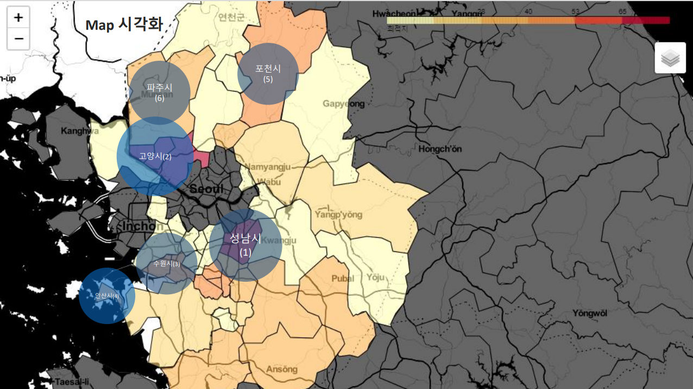

# Data_Visulization_Project

## Best place for Silvertown

### 프로젝트 소개

대한민국의 매우 빠른 고령화 현상과 그에 따른 실버타운 선호도의 증가를 인지하고, 추가적으로 실버타운을 건설시 중요한 인접 인프라를 찾아 선정하고 이에 해당하는 실버타운 건설 최적지를 분석해보고자 한다. 

## 1. 프로젝트 기간 & 참여인원
- 2023.08.04 ~ 2023.08.17
- 개인 프로젝트
  
## 2. 프로젝트 목적 및 기술

### 프로젝트 목적

Python을 기반으로 데이터 분석과 시각화 툴을 사용하여 실버타운 건설 최적지를 분석해보고자 한다. 

공공 데이터 및 크롤링을 통하여 데이터를 수집, 분석하고 시각화를 하는 것이 최종 목적이다. 

### 기술
- Python
- Pandas
- Numpy
- Matplolib
- Folium
- Jupyter Notebook

## 3. 분석 과정

### 고령인구 관련 분석
- 인구 고령화 현황
- 국내 실버타운 분석

### 고령화와 의료인프라
- 고령화와 의료인프라의 연관성 조사
- 전국 종합병원 분포현황 분석

### 각종 뉴스 및 논문, 국내 실버타운을 통하여 주요 인프라 선정
- 의료
- 교통
- 여가

### 분석 절차
1. 종합병원 분포를 통한 1위 지역 선정
2. 선정 지역 각 인프라 조사
   - 종합병원
   - 교통(버스터미널, 기차역, 지하철, 톨게이트, 지역버스노선 수)
   - 여가(공원, 골프장)
3. 해당 지역 종합점수 추출
   - 의료(50%)
   - 교통(30%)
   - 여가(20%)
   
### 분석결과

## 3. 개선할 점

의료 점수에 대한 세부항목을 다양화하지 못하여, 너무 편향적인 점수가 추출되었다.

의료 점수에 대한 세부항목을 다양화 한다면 조금 더 신뢰도 높은 결과가 될 것이다.

본 프로젝트를 기반으로 더 많은 인프라 요소를 조사 후 점수부여의 비율을 재책정한 후, 경기도의 읍, 면, 동으로 한층 더 깊은 분석을 하거나, 경기도라는 한정적인 지역이 아닌 전국적 건설 최적지를 분석해보고자 한다.

## 4. 느낀 점

데이터 수집에 있어서 크롤링 후 데이터를 정제하는 과정이 익숙치 않아 가장 어려웠던 것 같다.

또한 도메인 지식이 부족한 주제로 프로젝트를 진행하면서, 조금 더 자세하게 분석하기에는 시간적인 여유 및 지식이 부족해 분석결과가 더 신뢰도 높은 결과가 나오지 못한 것이 아쉽다.
